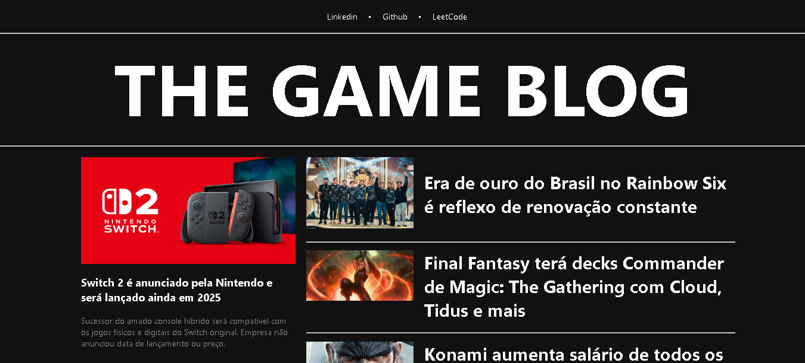

# 📖 Blog Simples

Um blog simples desenvolvido com **Angular**, permitindo exibir notícias em destaque e uma lista de artigos.



## ✨ Funcionalidades

- 📌 Exibição de notícias em destaque.
- 📰 Listagem de artigos em formato de cards.
- 🔄 Navegação entre diferentes seções.

## 🚀 Tecnologias Utilizadas

- **Angular** (Framework Front-end)
- **TypeScript** (Linguagem)
- **CSS** (Estilização)  

## 🔧 Como Executar o Projeto

1️⃣ **Clone o repositório**
```sh
git clone https://github.com/seu-usuario/blog-simples.git
cd blog-simples
```

2️⃣ **Instale as dependências**
```sh
npm install
```

3️⃣ **Execute o projeto**
```sh
ng serve
```
📌 Acesse: `http://localhost:4200/`

## 🛠️ Melhorias Futuras

- Integração com uma **API real** para buscar artigos.
- Adicionar funcionalidade de **pesquisa e categorias**.
- Implementar um **sistema de login** para autores.

## 📜 Licença

Este projeto é open-source e pode ser modificado e distribuído conforme necessário.
